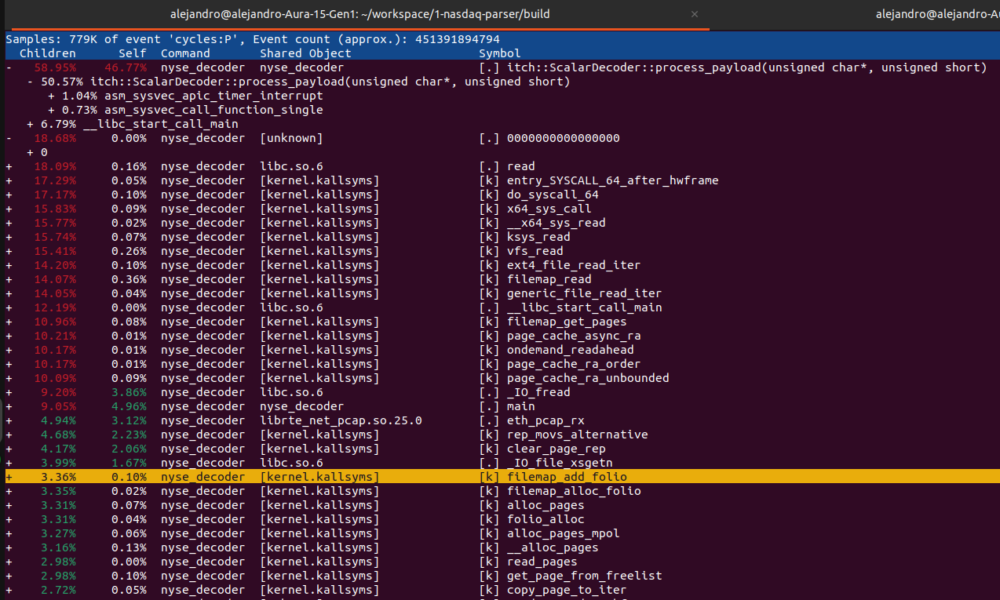

# NASDAQ TotalView-ITCH High-Performance Parser

Currently one-threaded high-performance C++ pipeline for parsing NASDAQ TotalView-ITCH PCAP dumps, built to research and benchmark HFT latency optimizations:

- Network I/O: DPDK poll-mode processing, goal of getting the packets with real networking and kernel bypass from PCIe.
- Decoding: MoldUDP64 transport parsing and ITCH message decoding.
- Compute & Data Structures: Profiling compiler optimizations (-O3, -march=native) and measuring the latency cost of standard C++ STL containers vs. custom zero-allocation structures as well as cache-aware optimisations.
- Order Book: Level 2 order book, with the goal of writing a Level 3 and improve the optimisations in it.

The goal is to optimise the pipeline, check different techniques, benchmark and compare them, and also grow it in completeness adding more functionalities such as book sequencer, multiplexer, strategy thread and lock-free synchronization mechanism (ring buffer if I keep it SPSC).

---

## Table of Contents
1. [Performance Summary (Tag v1.0.0)](#performance-summary-tag-v100)
   * [Conditions](#conditions)
   * [Latency Results](#latency-results)
   * [Analysis (Internal, perf stat, perf report)](#analysis)
2. [Roadmap](#roadmap)

---

## Performance Summary (Tag v1.1.0)

First change has been replaced the unordered_map by a open adress hash map using Linear Probing with Tombstone Deletion.. However, how this has increase the min speed of the Book order
by a lot, the worst case is grotesque, taking up to 1 milisecond!!!!

This is cause by the linear probing across tombstones. The program has a maximum of around 3 million active orders and with a space in the hash map of 
8 million I expected this to be enough. Alas, with my current algorithms tombstones never come back to being empty, so the program end iterating millions of times
trying to find the next empty in an array full of tombstones. 
The advantage of this open adrress hash map was that before the congestion the O(1) access in the array was way faster than the pointer chasing in unordered_map.

My perf stats shows the issue with  Linear Probing
```text
--- Book Order Processing Latency ---
Messages : 170567076
Min      : 0.50 ns
Avg      : 7664.41 ns
p50      : 711.32 ns
p90      : 13044.13 ns
p99      : 150889.14 ns
p99.9    : 380624.15 ns
Max      : > 1001853.43 ns (Overflow)
```

I will explore and implement Robin Hood hashing with Backward Shift Deletion. 
Robin Hood to keep the position with more sense and backward shift deletion to avoid to accumulate the Tombstones

After implementing Robin Hool and backward shit deletion a big improvent is notice. Execution time in the book order p99.9 is reduced
in comparison with the unordered_map and ofcourse as well in comparison with previous version of the open address hash map
```
--- Book Order Processing Latency ---
Messages : 388290471
Min      : 0.50 ns
Avg      : 311.19 ns
p50      : 190.35 ns
p90      : 801.48 ns
p99      : 1362.52 ns
p99.9    : 2093.87 ns
Max      : 224825.93 ns
```
Note: for future runs apply -> sudo cpupower frequency-set -g performance to have a common set here.
p99.9 was reduced from the v1.0.0 (using std::unordered_map) from 2,494.74 ns to **2093.87 ns**, around 20% improvement. p50 was reduced from 320 ns to 190 ns, more than 30% reduction.

Overal end to end time for the target file was reduced from 300s to 200s.

Performance counter stats for './nyse_decoder --no-huge -l 4 --vdev net_pcap0,rx_pcap=/home/alejandro/workspace/1-nasdaq-parser/build/ny4-xnas-tvitch-a-20230822-all-sorted.pcap,infinite_rx=0':
```text
        206,733.92 msec task-clock                       #    0.994 CPUs utilized             
            81,458      context-switches                 #  394.023 /sec                      
                 2      cpu-migrations                   #    0.010 /sec                      
            91,124      page-faults                      #  440.779 /sec                      
   728,160,477,314      cycles                           #    3.522 GHz                         (85.71%)
    62,810,684,119      stalled-cycles-frontend          #    8.63% frontend cycles idle        (85.71%)
   483,497,586,681      instructions                     #    0.66  insn per cycle            
                                                  #    0.13  stalled cycles per insn     (85.71%)
    91,843,148,185      branches                         #  444.258 M/sec                       (85.71%)
     2,247,099,731      branch-misses                    #    2.45% of all branches             (85.71%)
   244,173,477,674      L1-dcache-loads                  #    1.181 G/sec                       (85.71%)
    13,317,649,067      L1-dcache-load-misses            #    5.45% of all L1-dcache accesses   (85.71%)
   <not supported>      LLC-loads                                                             
   <not supported>      LLC-load-misses 
```
Also the instruction per cycle has improved from around 0.5 to 0.66 and the cache misses has fall around 0.5%. Some improvement but still work to do.
Afterward state:


  
   


Some points I need to focus.
1. The nyse_decoder [unknown_ process] using 20% sycles is hidden due to lack of debug files during compilation. But in combination with my own perf states
it is easy to deduce that this heavy load is still comming from the OrderBook.
2. There is a lot of load due to system calls reading the input file.

There is a option of improving both points simultaneusly using hugepages ro reduce the TLB (translation lookaside buffer) misses.
Reasoning, the open address map is allocating 8.3 million slots. AS will be used with Order Entry this is aroun 200Mb of data.

In normal conditions the operating system manage memory in 4kb pages. This mean 50k pages. The CPU TLB that translate virtual memory into physical RAM
can only cache some thousand pages. So not all of the 50k required in normal conditions to contain my map can be simultanuesly at the cache, and since the 
hash is probing there are constant TLB misses (TLB thrashing).

Using hugepages I can solve this easily. With a rather small (for hugeages) page of 2Mb I only need 100 pages to contain my hash map. And all that pages can
be manage simultaneusly by the TLB, so no misses there.

This also will improve the performance of dpdk function reading the file  from disk. rte_eal_init() will reserve the amount of memory it needs for the
rte_mempool and will similary be benefited by less cache misses.

For the system set up and dpdk this is pretty easy to do, symply sudo sysctl -w vm.nr_hugepages=2048 and then call the app with --in_memory instead of --no_huge

For the open address hash map needs a bit of work, to mmap memory to hugepages, and replace the make unique.


After that the remaining optimization is to work in the replacement of the std::map
and align as 16 the order entry
std::map -> Flat sparse array
alignas(16) the order entry to make it more cache friendly


## Performance Summary (Tag v1.0.0)

### Conditions
The conditions used for the benchmark are:
- Code pinning to one core that has been isolated from other tasks using the GRUB file.
- Number of cycles are computed using `rte_rdtsc()` and converted into time using `rte_get_tsc_hz()`.
- A PCAP file containing NASDAQ messages from the pre-opening of the session is used. It contains 399,621,195 ITCH messages.
- For the analysis, I used an internal counter feeding a histogram, and also `perf stat` and `perf report`.

### Latency Results

| Metric                                           | Without `-O3 -march=native` | With `-O3 -march=native` |
|-------------------------------------------------|-----------------------------|--------------------------|
| End-to-end RX loop wall time                    | 423.88 s                    | 257.05 s                |
| Total ITCH messages processed                   | 399,621,195                 | 399,621,195             |
| **Decode-only latency (avg)**                   | 10.89 ns                    | 11.21 ns                |
| Decode-only p50                                 | 10.02 ns                    | 10.02 ns                |
| Decode-only p90                                 | 10.02 ns                    | 10.02 ns                |
| Decode-only p99                                 | 30.06 ns                    | 50.10 ns                |
| **OrderBook update latency (avg)**              | 872.22 ns                   | 432.99 ns               |
| OrderBook p50                                   | 741.41 ns                   | 320.61 ns               |
| OrderBook p90                                   | 1,593.03 ns                 | 1,031.96 ns             |
| OrderBook p99                                   | 2,554.85 ns                 | 1,723.27 ns             |
| OrderBook p99.9                                 | 3,847.31 ns                 | 2,494.74 ns             |
| **Full ITCH processing latency (avg)**          | 899.77 ns                   | 478.13 ns               |
| Full ITCH p50                                   | 781.48 ns                   | 360.69 ns               |
| Full ITCH p90                                   | 1,633.10 ns                 | 1,082.06 ns             |
| Full ITCH p99                                   | 2,614.97 ns                 | 1,783.39 ns             |
| Full ITCH p99.9                                 | 3,937.48 ns                 | 2,594.93 ns             |

The average time for parsing, decoding and inserting a message into the book order is ~430 ns for the `-O3` optimized run. However, it is important to check the slow outliers since those are the ones that must be corrected first. 10% of the messages take more than 1000 ns, and 0.1% take more than 2500 ns. Some of the slow messages are likely not in the hot path, as the `StockTradingDirectory` messages, but the processing of the p99 is definitely too slow and must be corrected.

---

### Analysis

#### Using `Internal Benchmarking`:
Decoding a message takes around 10 ns while passing it to the book order takes around 430 ns. Clearly, the full message process is dominated by the BookOrder. The decoding time is just a fraction of it. Therefore, the first effort is to improve the design of the BookOrder, which currently uses `std::map` and `std::unordered_map`, causing a loss of time with allocations.

#### Using `perf stat`:
```text
task-clock:         256,141.95 msec   # 0.999 CPUs utilized
cycles:             1,023,298,986,323 # ~3.995 GHz
instructions:         527,395,652,867 # 0.52 insn per cycle
stalled-cycles-front:64,719,917,588   # 6.32% frontend cycles idle
branches:           101,774,564,563   # 397M/sec
branch-misses:        2,245,859,470   # 2.21% of branches
L1-dcache-loads:    278,195,602,471   # 1.086 G/sec
L1-dcache-load-miss:16,687,578,542    # 6.00% L1 miss rate
context-switches:          1,612      # very few
cpu-migrations:               2
page-faults:           100,223
```
- **0.999 CPU usage** indicates that the code is being run almost exclusively on one core, helped by the isolation of that core with GRUB. The remaining time is likely related to the BIOS and not solvable while running with a normal Linux laptop.
- **Instructions per cycle are low: 0.52 insn.** This indicates that the core has stalled a lot. In combination with the time spent in the BookOrder, this is likely the consequence of `std::map` and `std::unordered_map`. In those structures, there is a lot of pointer chasing and indirections, not a tight arithmetic loop.
- **Branch misses are low: 2.21%.** This is a good point, indicating that the while loop in the decoder is easy to predict.
- **L1 miss rate is high: 6.00%.** This relates to the IPC and is likely caused by the same issue with `std::map` and `std::unordered_map`.

#### Using `perf report`:


- Due to `-O3` aggressive optimization and hints in the code, almost all functions are inlined and disappear, so we see that the computation basically becomes `process_payload` and expends 60% of the time there.
- ~20% of the time is spent in the iterator in the hash map, so that is one more confirmation of what the internal benchmarking showed. But I got the clue that the problem is in the `std::unordered_map` and not in the `std::map`. In the perf report, it is clearly written `_Hashtable` and not `_Rb_tree` (the internal implementation of the `std::map`).
- The remaining red objects `[kernel.kallsyms]` are system calls related to the fact that we are using DPDK in poll mode to read a file from the hard drive. A real NIC would write directly into the RAM using DMA, so these system calls would disappear. For a future version, I plan to receive packets from an FPGA using PCIe and then test the code without this.

---

## Roadmap

I plan to apply the next changes, both to diminish the latency and to make this project more complex and representative of a real pipeline

1. **Zero-Allocation Order Book (Targeting `v1.1.0`)**
   * Replace `std::unordered_map` and maybe `std::map` (depending of the result of benchmarking after removing unordered_map) with pre-allocated flat hash maps and arrays to remove heap allocation and iterations that are currently eating a lot of cycles in hot path. 
2. **Level 3 BookOrder (Targeting `v.2.0.0`)**
   * Improve the BookOrder to create a level 3 one
3. **Symbol Multiplexer**
   * Introduce a routing layer to direct ITCH events to per-symbol order books,  in this way modeling a more realistic multi-instrument setup and preparing the possibility of thread-level parallelism.
4. **Sequencer & Recovery**
   * Implement a MoldUDP64/ITCH sequencer to track expected sequence numbers and detect packet drops/gaps.
5. **Lock-Free SPSC Queue**
   * Split the architecture into a Feed Handler thread (decode) and a Strategy thread, connected via a lock-free Single-Producer Single-Consumer (SPSC) ring buffer.
6. **Hardware Integration (PCIe/FPGA)**
   * Replace the DPDK PCAP poll loop with a AWS setup where a dedicated core streams packets over PCIe to an FPGA  where I will introduce a bitstream to make it act like a mirror and send packets back to me, testing the software against a more real network DMA situation